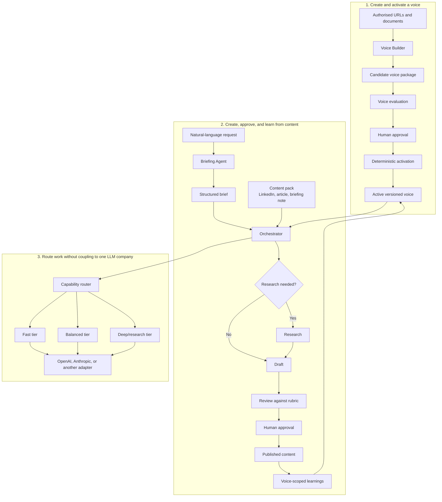

# Content Creator

A provider-neutral foundation for creating researched or non-researched content
in a person's approved voice.

The repository separates four concerns:

- **voice**: how a person sounds, including evidence, constraints, and learnings;
- **content packs**: what is being produced, such as a LinkedIn post or article;
- **workflow**: briefing, optional research, drafting, review, approval, and learning;
- **models**: which provider and capability tier executes each task.

## How the system fits together



The user can make the same request regardless of provider:

> Write a short LinkedIn post explaining why calculus matters to sixth-form
> students. No research is required.

The Briefing Agent turns that into a structured brief. The orchestrator decides
which workflow stages and capability tiers are needed. Provider adapters translate
the same internal request into each vendor's API format.

## Repository status

The provider-neutral content engine and LinkedIn compatibility pack are now
executable. The repository contains:

- a deterministic orchestrator, persistent run state, bounded revision loop,
  validation, quality gates, publication, and voice-scoped learning;
- OpenAI and Anthropic adapters behind one normalized request contract;
- LinkedIn post and article packs covering none, light, and deep research;
- a deep agent-research approval checkpoint and supplied-research routes;
- a replay harness that executes all six routes against both provider contracts;
- offline CI, manual live-provider evaluation, and a repo-local conversational
  skill;
- the reviewed Voice Builder work package in
  [`docs/work-package`](docs/work-package).

Voice-source ingestion, attribution analysis, candidate evaluation, and
deterministic voice activation remain planned work. Until they land, the engine
uses the deliberately generic `default` placeholder profile.

The detailed capability-by-capability comparison is in
[`docs/linkedin-writer-migration-audit.md`](docs/linkedin-writer-migration-audit.md).

The staged implementation and acceptance criteria are in
[`docs/work-package/delivery-plan.md`](docs/work-package/delivery-plan.md) and
[`docs/work-package/testing-and-acceptance.md`](docs/work-package/testing-and-acceptance.md).

## Quick start: from a new clone to finished content

Requires Python 3.9 or newer.

> **Current status:** content planning, all six LinkedIn routes, provider
> adapters, research checkpoints, review, repository publication, learning,
> replay evaluation, and CI work today. The Voice Builder commands in steps 3–5
> remain the target interface for the next implementation stage.

### 1. Install and check the repository

```bash
git clone https://github.com/vadhoob90/Content_Creator.git
cd Content_Creator
python -m venv .venv
source .venv/bin/activate
python -m pip install -e ".[providers,dev]"
content-creator doctor
content-creator eval
```

`doctor` validates the model catalogue, installed packs, default voice, and
route cases without making an LLM call. `eval` replays all six LinkedIn routes
against both provider contracts without using paid APIs.

### 2. Configure an LLM provider

[`config/models.yaml`](config/models.yaml) maps the generic `fast`, `balanced`,
and `deep` capability tiers to ordered provider model candidates. Agents and
the orchestrator refer to capability profiles, not vendor model names.

For OpenAI:

```bash
export OPENAI_API_KEY="<your API key>"
```

For Anthropic:

```bash
export ANTHROPIC_API_KEY="<your API key>"
```

Then verify the routing decision:

```bash
content-creator plan \
  "Write a short LinkedIn post. No research." \
  --provider openai

content-creator plan \
  "Research 70 years of human-machine interaction for a LinkedIn article." \
  --provider anthropic
```

Deterministically clear requests do not call a model during planning. Ambiguous
requests use the configured fast-tier Briefing Agent. The catalogue defines a
default provider, so normal content requests do not need to name one.

Additional providers implement the normalized `Provider` interface, register
with `ProviderRegistry`, and add capability profiles to `config/models.yaml`.
See [`docs/guides/provider-configuration.md`](docs/guides/provider-configuration.md).

### 3. Prepare voice source material (Voice Builder: planned)

Only use material you are authorised to analyse. Put one public URL per line in
a text file:

```text
# voice-material/example-person/source-urls.txt
https://example.com/example-person/article-one
https://example.com/example-person/interview
```

Put private source documents in the same voice-specific directory:

```text
voice-material/
└── example-person/
    ├── source-urls.txt
    ├── keynote-transcript.txt
    └── published-article.docx
```

Private extracted source content will be kept in the ignored `.voice-cache/`
directory. The versioned profile retains provenance metadata and hashes, rather
than silently copying the source corpus into Git.

### 4. Create and review a candidate voice (planned)

The target command is:

```bash
content-creator voice create \
  --name "Example Person" \
  --authorised-by "Repository Owner" \
  --use linkedin-post \
  --use linkedin-article \
  --sources voice-material/example-person/source-urls.txt \
  --documents voice-material/example-person/
```

This single command will:

1. ingest and deduplicate the supplied material;
2. check whether Example Person is the author, co-author, interviewee, or merely the
   subject of each source;
3. assess whether there is enough representative evidence;
4. build the profile, constraints, voice-specific rubric, and evaluation cases;
5. test the candidate against held-out material; and
6. stop at `awaiting_approval`. It will not activate its own result.

Inspect the candidate before approving it:

```bash
content-creator voice status example-person
content-creator voice show example-person
content-creator voice verify example-person
```

Review the claimed voice patterns, their supporting sources and counterexamples,
the prohibited behaviours, unsupported content types, and the evaluation report.
If the candidate is weak, add better sources and rebuild:

```bash
content-creator voice add-sources example-person \
  --sources voice-material/example-person/additional-urls.txt
content-creator voice rebuild example-person
```

### 5. Approve and activate the voice (planned)

When you are satisfied:

```bash
content-creator voice approve example-person
```

Approval is a deterministic operation rather than another creative-agent task.
It validates the candidate and authorisation, assigns a stable version, writes an
approval receipt, updates the voice registry, activates the voice-specific rubric
and constraints, and creates its isolated learning namespace. Repeating the
command is safe and produces no duplicate activation.

Confirm the result:

```bash
content-creator voice list
content-creator voice status example-person
```

### 6. Initiate content creation

You can start with natural language in Codex or another supported agent surface:

> Use the Content Creator workflow in this repository. Write a short LinkedIn
> post in the `default` voice explaining why calculus matters to sixth-form
> students. No research is required. Stop for my approval before finalising it.

For a research-heavy request:

> Use the Content Creator workflow in this repository. In the `default` voice,
> develop a LinkedIn article about how humans have interacted with machines over
> the last 70 years. Use deep research, preserve source attribution, and stop for
> my approval before finalising it.

You do not normally need to name a provider or model. The Briefing Agent turns
your request into a structured brief, including research depth. The orchestrator
selects the capability tier, and the configured provider adapter supplies the
model. You can still request `--provider anthropic` or `--provider openai` when
you deliberately want an override.

The executable CLI flow is:

```bash
content-creator run \
  "Explain why calculus matters to sixth-form students" \
  --voice default \
  --pack linkedin-post \
  --research none \
  --provider anthropic

content-creator status <run-id>
content-creator publish <run-id> \
  --feedback "Preserve the concrete opening."
```

For deep agent research, inspect `runs/<run-id>/research.json` and resume with
`content-creator approve-research <run-id>`. `publish` captures acceptance,
writes the finished artifact to the pack's published directory, and triggers a
voice-scoped learning update. It does not post externally.

### 7. What to build next

The provider-neutral core and LinkedIn compatibility packs are implemented. The
next substantial task is the versioned voice lifecycle beginning with
[WP-03](docs/work-package/delivery-plan.md#wp-03-add-voice-domain-and-registry-models),
followed by ingestion, attribution, voice analysis, evaluation, and
deterministic activation. The direct `general-text` pack also still needs its
end-to-end runner.

## Licence

The software is available under the
[PolyForm Noncommercial License 1.0.0](LICENSE.md). It permits non-commercial
use, modification, and distribution under its terms. It does not grant commercial
use rights and is not an OSI-approved open-source licence.

Required Notice: Copyright 2026 Bharath Vadhoola
