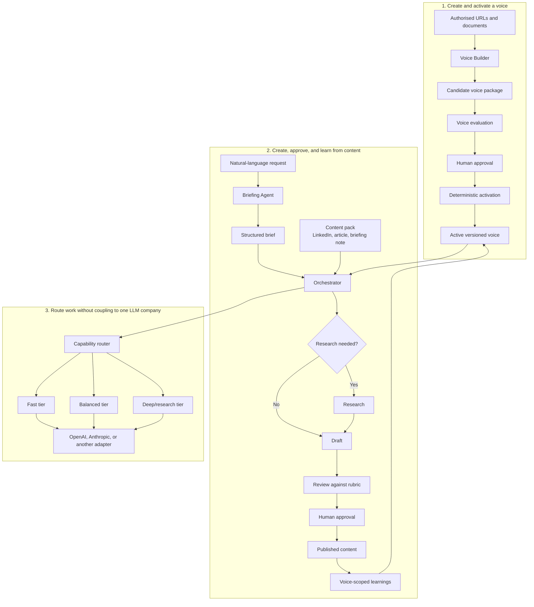

# Content Creator

A provider-neutral foundation for creating researched or non-researched content
in a person's approved voice.

The repository separates four concerns:

- **voice**: how a person sounds, including evidence, constraints, and learnings;
- **content packs**: what is being produced, such as a LinkedIn post or article;
- **workflow**: briefing, optional research, drafting, review, approval, and learning;
- **models**: which provider and capability tier executes each task.

## How the system fits together



The user can make the same request regardless of provider:

> Write a short LinkedIn post explaining why calculus matters to sixth-form
> students. No research is required.

The Briefing Agent turns that into a structured brief. The orchestrator decides
which workflow stages and capability tiers are needed. Provider adapters translate
the same internal request into each vendor's API format.

## Repository status

This first commit is an **implementation-ready scaffold**, not a finished content
engine. It contains:

- the reviewed architecture and delivery work package in [`docs/work-package`](docs/work-package);
- a provider-neutral capability catalogue and deterministic routing helper;
- a general text content-pack skeleton;
- initial tests for configuration and routing;
- the non-commercial software licence.

The staged implementation and acceptance criteria are in
[`docs/work-package/delivery-plan.md`](docs/work-package/delivery-plan.md) and
[`docs/work-package/testing-and-acceptance.md`](docs/work-package/testing-and-acceptance.md).

## Quick start: from a new clone to finished content

Requires Python 3.11 or newer.

> **Current status:** this repository contains the tested foundation and complete
> delivery plan. `doctor` and `plan` work today. The `voice` and `content` commands
> below describe the end-to-end operator flow that the remaining
> [work packages](docs/work-package/delivery-plan.md) will implement. They are
> documented now so the intended user experience is explicit and testable.

### 1. Install and check the repository

```bash
git clone https://github.com/vadhoob90/Content_Creator.git
cd Content_Creator
python -m venv .venv
source .venv/bin/activate
python -m pip install -e .
content-creator doctor
```

`doctor` validates the provider catalogue, content pack, profile registry, and
core rubric without making an LLM call.

### 2. Configure an LLM provider

[`config/providers.json`](config/providers.json) maps the generic `fast`,
`balanced`, and `deep` capability tiers to environment variables. Agents and the
orchestrator refer to tiers, not vendor model names.

For OpenAI:

```bash
export OPENAI_API_KEY="<your API key>"
export OPENAI_FAST_MODEL="<your fast OpenAI model>"
export OPENAI_BALANCED_MODEL="<your balanced OpenAI model>"
export OPENAI_DEEP_MODEL="<your deep OpenAI model>"
```

For Anthropic:

```bash
export ANTHROPIC_API_KEY="<your API key>"
export ANTHROPIC_FAST_MODEL="<your fast Anthropic model>"
export ANTHROPIC_BALANCED_MODEL="<your balanced Anthropic model>"
export ANTHROPIC_DEEP_MODEL="<your deep Anthropic model>"
```

Then verify the routing decision:

```bash
content-creator plan --provider openai --complexity simple
content-creator plan --provider anthropic --complexity deep
```

`plan` works today and does not call an LLM. The completed engine will also
support a default provider, so normal content requests will not need to mention
OpenAI or Anthropic.

### 3. Prepare the voice source material

Only use material you are authorised to analyse. Put one public URL per line in
a text file:

```text
# voice-material/aisha/source-urls.txt
https://example.com/aisha/article-one
https://example.com/aisha/interview
```

Put private source documents in the same voice-specific directory:

```text
voice-material/
└── aisha/
    ├── source-urls.txt
    ├── keynote-transcript.txt
    └── published-article.docx
```

Private extracted source content will be kept in the ignored `.voice-cache/`
directory. The versioned profile retains provenance metadata and hashes, rather
than silently copying the source corpus into Git.

### 4. Create and review a candidate voice

The target command is:

```bash
content-creator voice create \
  --name "Aisha Khan" \
  --authorised-by "Bharath" \
  --use linkedin-post \
  --use linkedin-article \
  --sources voice-material/aisha/source-urls.txt \
  --documents voice-material/aisha/
```

This single command will:

1. ingest and deduplicate the supplied material;
2. check whether Aisha is the author, co-author, interviewee, or merely the
   subject of each source;
3. assess whether there is enough representative evidence;
4. build the profile, constraints, voice-specific rubric, and evaluation cases;
5. test the candidate against held-out material; and
6. stop at `awaiting_approval`. It will not activate its own result.

Inspect the candidate before approving it:

```bash
content-creator voice status aisha-khan
content-creator voice show aisha-khan
content-creator voice verify aisha-khan
```

Review the claimed voice patterns, their supporting sources and counterexamples,
the prohibited behaviours, unsupported content types, and the evaluation report.
If the candidate is weak, add better sources and rebuild:

```bash
content-creator voice add-sources aisha-khan \
  --sources voice-material/aisha/additional-urls.txt
content-creator voice rebuild aisha-khan
```

### 5. Approve and activate the voice

When you are satisfied:

```bash
content-creator voice approve aisha-khan
```

Approval is a deterministic operation rather than another creative-agent task.
It validates the candidate and authorisation, assigns a stable version, writes an
approval receipt, updates the voice registry, activates the voice-specific rubric
and constraints, and creates its isolated learning namespace. Repeating the
command is safe and produces no duplicate activation.

Confirm the result:

```bash
content-creator voice list
content-creator voice status aisha-khan
```

### 6. Initiate content creation

You can start with natural language in Codex or another supported agent surface:

> Use the Content Creator workflow in this repository. Write a short LinkedIn
> post in the `aisha-khan` voice explaining why calculus matters to sixth-form
> students. No research is required. Stop for my approval before finalising it.

For a research-heavy request:

> Use the Content Creator workflow in this repository. In the `aisha-khan` voice,
> develop a LinkedIn article about how humans have interacted with machines over
> the last 70 years. Use deep research, preserve source attribution, and stop for
> my approval before finalising it.

You do not normally need to name a provider or model. The Briefing Agent turns
your request into a structured brief, including research depth. The orchestrator
selects the capability tier, and the configured provider adapter supplies the
model. You can still request `--provider anthropic` or `--provider openai` when
you deliberately want an override.

The equivalent target CLI flow is:

```bash
content-creator content run \
  "Explain why calculus matters to sixth-form students" \
  --voice aisha-khan \
  --pack linkedin-post \
  --research none

content-creator content status <run-id>
content-creator content approve <run-id>
content-creator content finalize <run-id>
```

`approve` captures your acceptance. `finalize` writes the finished artifact to
the pack's published directory and triggers a voice-scoped learning update.
Finalisation does not post externally to LinkedIn or another platform.

### 7. What to build next

The immediate engineering task is
[WP-01: Extract the provider-neutral core](docs/work-package/delivery-plan.md#wp-01-extract-the-provider-neutral-core),
followed by content packs and the voice lifecycle. Each work package has its own
acceptance tests. The end-to-end quick start becomes executable as those stages
land; until then, it serves as the operator contract the implementation must
satisfy.

## Licence

The software is available under the
[PolyForm Noncommercial License 1.0.0](LICENSE.md). It permits non-commercial
use, modification, and distribution under its terms. It does not grant commercial
use rights and is not an OSI-approved open-source licence.

Required Notice: Copyright 2026 Bharath Vadhoola
