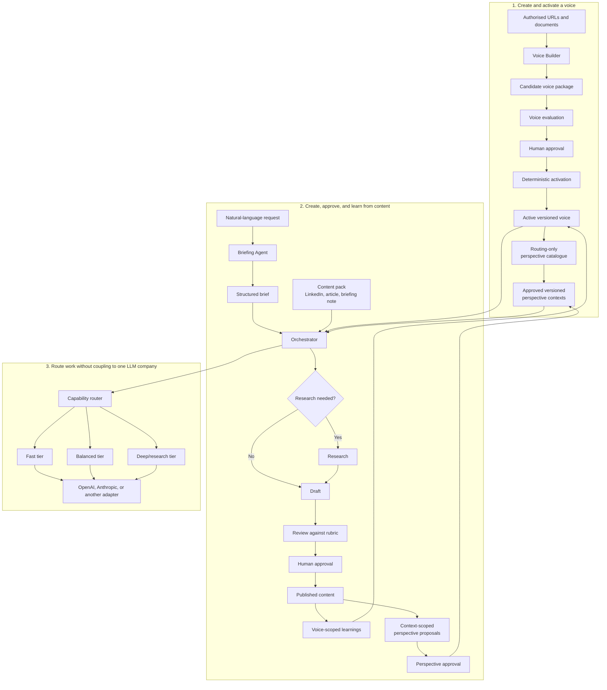

# Content Creator

A provider-neutral foundation for creating researched or non-researched content
in a person's approved voice.

The LLM supplies intelligence; the scaffolding supplies direction, memory,
boundaries and accountability.

**Why not just use a chat application?** ChatGPT and Claude already offer
projects, instructions, memory, files, and style customisation. Content Creator
adds a provider-neutral, reviewable publication process with explicit provenance,
scope, approval, versioning, and learning boundaries. Read
[Why not just use ChatGPT or Claude?](docs/guides/why-not-just-chat.md).

The repository separates six concerns:

- **agents**: repository-owned editorial and domain behaviour;
- **voice**: how a person sounds, including evidence, constraints, and learnings;
- **perspective**: what the person has explicitly said or approved in a named
  subject context;
- **content packs**: what is being produced, such as a LinkedIn post or article;
- **workflow**: briefing, optional research, drafting, review, approval, and learning;
- **models**: which provider and capability tier executes each task.

## Create a new author workspace

Most users should not clone Core. Generate a thin repository that pins Core and
contains only author-owned voices, perspectives, sources, learnings, agents,
content, and tests:

```bash
content-creator workspace create Content_Creator_Alice \
  --name "Content Creator Alice" \
  --author-name "Alice Example" \
  --voice-id alice-general \
  --pack linkedin-post \
  --pack linkedin-article
```

The command creates the dependency, configuration, repository guidance, source
inventory, voice-scoped learning, content destinations, smoke tests, and a
personalised README with chat and CLI onboarding. It preserves every existing
file when rerun. See
[Create a thin content workspace](docs/guides/creating-a-content-workspace.md).

## How the system fits together



The user can make the same request regardless of provider:

> Write a short LinkedIn post explaining why calculus matters to sixth-form
> students. No research is required.

The Briefing Agent turns that into a structured brief. The orchestrator decides
which workflow stages and capability tiers are needed. Provider adapters translate
the same internal request into each vendor's API format.

## Repository status

The provider-neutral content engine and LinkedIn compatibility pack are now
executable. The repository contains:

- a deterministic orchestrator, persistent run state, bounded revision loop,
  validation, quality gates, publication, and voice-scoped learning;
- OpenAI and Anthropic API adapters plus Codex and Claude native subscription
  adapters behind one normalized request contract;
- LinkedIn post and article packs covering none, light, and deep research;
- a deep agent-research approval checkpoint and supplied-research routes;
- a replay harness that executes all six LinkedIn routes plus direct
  `general-text` against both provider contracts;
- offline CI, manual live-provider evaluation, and a repo-local conversational
  skill;
- executable Voice Builder commands and the supporting work package in
  [`docs/work-package`](docs/work-package).

Voice-source ingestion, deterministic attribution, corpus assessment,
agent-assisted voice analysis and criticism, candidate evaluation, versioned
approval, deactivation, and pinned runtime resolution are implemented. The
generic `default` profile remains available for a quick trial without creating
a personal voice.

The detailed capability-by-capability comparison is in
[`docs/linkedin-writer-migration-audit.md`](docs/linkedin-writer-migration-audit.md).

For production implementations, install a tagged engine release from a thin,
separate repository. See the
[versioned core and workspace guide](docs/guides/workspace-dependencies.md).
Editable agents and the two learning scopes are described in the
[repository agents guide](docs/guides/repository-agents.md).
Existing v0.2 workspaces should follow the
[v0.3 migration guide](docs/guides/migrating-to-v0.3.md).

Start with the top-down guide to
[how Content Creator derives a voice](docs/guides/how-voice-is-derived.md).
It explains the complete path from authorised sources to an approved immutable
version, then drills into attribution, corpus weighting, deterministic
measurements, model-assisted interpretation, evaluation, algorithms, safeguards,
and limitations. The supporting
[lightweight linguistic framework](docs/guides/linguistic-voice-framework.md)
documents the measurement model in a shorter form.

[Perspective provenance](docs/guides/perspective-provenance.md) keeps approved
author positions separate from voice, research, and other subject contexts.
Perspective use is explicit by default; workspaces may opt into automatic,
catalogue-based selection of zero, one, or several approved contexts.

The staged implementation and acceptance criteria are in
[`docs/work-package/delivery-plan.md`](docs/work-package/delivery-plan.md) and
[`docs/work-package/testing-and-acceptance.md`](docs/work-package/testing-and-acceptance.md).

## Core contributor quick start: installation to your first finished piece

Requires Python 3.9 or newer.

### 1. Clone and install

```bash
git clone https://github.com/vadhoob90/Content_Creator_Core.git
cd Content_Creator_Core
python -m venv .venv
source .venv/bin/activate
python -m pip install -e ".[dev]"
```

On Windows PowerShell, activate with `.venv\Scripts\Activate.ps1`.

### 2. Initialise and check the installation

```bash
content-creator init
content-creator doctor
content-creator eval
```

`doctor` validates the model catalogue, installed packs, default voice, and
route cases without making an LLM call. `init` also scaffolds repository-owned
agents and empty repository learning memory without overwriting existing files.
`eval` runs the LinkedIn and
`general-text` replay routes against both provider contracts without using paid
APIs. Both commands should finish successfully before you continue.

Inspect or compare the editable agent starting points:

```bash
content-creator agents status
content-creator agents diff-template
```

### 3. Choose an execution mode

[`config/models.yaml`](config/models.yaml) maps the generic `fast`, `balanced`,
and `deep` capability tiers to ordered provider model candidates. Agents and
the orchestrator refer to capability profiles, not vendor model names.

There are two execution modes:

| Mode | Providers | Best for | Credentials |
|---|---|---|---|
| **Native (preferred)** | `codex-native`, `claude-native` | Normal local and interactive use | Existing ChatGPT or Claude subscription login |
| **API** | `openai`, `anthropic` | CI, headless automation and metered workloads | Provider API key |

Start with native mode. It avoids separate API-key setup and uses the relevant
product subscription allowance.

For Codex:

```bash
codex login
export CONTENT_CREATOR_PROVIDER="codex-native"
content-creator provider verify codex-native
```

For Claude Code:

```bash
claude auth login
export CONTENT_CREATOR_PROVIDER="claude-native"
content-creator provider verify claude-native
```

Native verification rejects API-key and Console authentication so that a run
cannot silently fall back to usage-based billing.

For API mode, install the provider SDKs:

```bash
python -m pip install -e ".[providers,dev]"
```

OpenAI API:

```bash
export OPENAI_API_KEY="<your API key>"
export CONTENT_CREATOR_PROVIDER="openai"
content-creator provider verify openai
```

Anthropic API:

```bash
export ANTHROPIC_API_KEY="<your API key>"
export CONTENT_CREATOR_PROVIDER="anthropic"
content-creator provider verify anthropic
```

Choose one provider; you do not need all four. Verify how a clear request will be
routed without generating content:

```bash
content-creator plan \
  "Write a short LinkedIn post. No research." \
  --provider codex-native

content-creator plan \
  "Research 70 years of human-machine interaction for a LinkedIn article." \
  --provider claude-native
```

Deterministically clear requests do not call a model during planning. Ambiguous
requests use the configured fast-tier Briefing Agent. The catalogue defines a
default provider, so normal content requests do not need to name one.

Additional providers implement the normalized `Provider` interface, register
with `ProviderRegistry`, and add capability profiles to `config/models.yaml`.
See [`docs/guides/provider-configuration.md`](docs/guides/provider-configuration.md).

### 4. Prepare authorised voice material

Only use material you are authorised to analyse. Put one public URL per line in
a text file:

```text
# voice-material/example-person/source-urls.txt
https://example.com/example-person/article-one
https://example.com/example-person/interview
```

Put private source documents in the same voice-specific directory:

```text
voice-material/
└── example-person/
    ├── source-urls.txt
    ├── keynote-transcript.txt
    └── published-article.docx
```

Private extracted source content will be kept in the ignored `.voice-cache/`
directory. The versioned profile retains provenance metadata and hashes, rather
than silently copying the source corpus into Git.

### 5. Create a candidate voice

Run:

```bash
content-creator voice create \
  --voice-id example-person \
  --label "Example Person — General" \
  --author-name "Example Person" \
  --authorised-by "Repository Owner" \
  --use linkedin-post \
  --use linkedin-article \
  --sources voice-material/example-person/source-urls.txt \
  --documents voice-material/example-person/
```

This command:

1. ingest and deduplicate the supplied material;
2. check whether Example Person is the author, co-author, interviewee, or
   merely the subject of each source;
3. assess whether there is enough representative evidence;
4. ask the Voice Analyst for evidence-backed patterns;
5. ask the independent Profile Critic to challenge them;
6. build and evaluate the candidate package; and
7. stop at `awaiting_approval` when the gates pass, or `built` with actionable
   gaps when they do not. It will not activate its own result.

If a URL fails, fix it or add another source and run `voice rebuild`; completed
sources remain cached locally.

### 6. Review the candidate

```bash
content-creator voice status example-person
content-creator voice show example-person
content-creator voice signature example-person
content-creator voice verify example-person
```

Review the claimed voice patterns, their supporting sources and counterexamples,
the attribution-weighted linguistic measurements, the prohibited behaviours,
unsupported content types, and the evaluation report. Measurements describe
ranges; they are not fixed writing targets or proof of authorship.
If the candidate is weak, add better sources and rebuild:

```bash
content-creator voice add-sources example-person \
  --sources voice-material/example-person/additional-urls.txt
content-creator voice rebuild example-person
```

Do not continue until `voice status` reports `awaiting_approval` and
`voice verify` reports `"valid": true`.

### 7. Approve and activate the voice

When you are satisfied:

```bash
content-creator voice approve example-person \
  --approved-by "Repository Owner"
```

Approval is a deterministic operation rather than another creative-agent task.
It validates the candidate and authorisation, assigns a stable version, writes an
approval receipt, updates the voice registry, activates the voice-specific rubric
and constraints, and creates its isolated learning namespace. Repeating the
command is safe and produces no duplicate activation.

Confirm the result:

```bash
content-creator voice list
content-creator voice status example-person
```

The receipt reports the exact activated version, such as `1.0.0`.

#### Optional: create a subject-specific perspective

Voice approval records how the person communicates. If a piece should express
the person's established view, create a separate context:

```bash
content-creator perspective create \
  --voice example-person \
  --context professional-training \
  --statement "Training should teach recognition and escalation." \
  --type principle \
  --evidence "Direct author interview"

content-creator perspective verify \
  --voice example-person --context professional-training

content-creator perspective approve \
  --voice example-person \
  --context professional-training \
  --approved-by "Repository Owner"
```

Perspective use is explicit by default. Different contexts for the same person
never inherit from one another. A workspace may instead enable automatic
catalogue resolution while keeping the same approval and isolation rules. See the
[perspective provenance guide](docs/guides/perspective-provenance.md).

### 8. Create your first piece

For a simple LinkedIn post:

```bash
content-creator run \
  "Explain why calculus matters to sixth-form students" \
  --voice example-person \
  --pack linkedin-post \
  --research none
```

Add `--perspective-context professional-training` when an explicit-mode run
should use that approved position. Automatic-mode workspaces select only from
their routing-only catalogue; use `--no-perspective` for a neutral override.
Use `--thesis "..." --author-supplied` to record a new thesis supplied for the
current run; it does not automatically become a reusable perspective.

For a general document rather than LinkedIn:

```bash
content-creator run \
  "Write a 500-word explanation of why calculus matters" \
  --voice example-person \
  --pack general-text \
  --length 450:550 \
  --research none
```

The command prints a run ID. Check the result:

```bash
content-creator status <run-id>
cat runs/<run-id>/final.md
cat runs/<run-id>/resolved-context.json
```

The resolved context records the exact content-pack, voice, and perspective
versions used. `perspective-resolution.json` records catalogue selections,
reasons, confidence, and the catalogue hash. `claim-provenance.json` separates
author input, approved perspective, research, and model-proposed framing.

### 9. Handle a deep-research checkpoint

Deep agent research deliberately stops before drafting:

```bash
content-creator run \
  "Research how humans interacted with machines over the last 70 years" \
  --voice example-person \
  --pack linkedin-article \
  --research deep

cat runs/<run-id>/research.json
content-creator approve-research <run-id>
```

Use `reject-research` instead when the evidence or scope is not acceptable.

### 10. Approve and publish inside the repository

After reviewing `final.md`:

```bash
content-creator publish <run-id> \
  --feedback "Preserve the concrete opening."
```

This copies the finished piece to the selected pack’s `published` directory,
records the assessment, and updates only that voice’s learning memory. If the
run resolved perspective contexts, publication may also create proposals inside
those contexts. Direct contradictions can be proposed as `qualify`, `replace`,
or `supersede` changes against exact entry ids. Proposals require separate
deterministic approval. Publication never posts externally and never overwrites
an existing file.

### Using the workflow conversationally

You can start with natural language in Codex or another supported agent surface:

> Use the Content Creator workflow in this repository. Write a short LinkedIn
> post in the `example-person` voice explaining why calculus matters to sixth-form
> students. No research is required. Stop for my approval before finalising it.

For a research-heavy request:

> Use the Content Creator workflow in this repository. In the `example-person` voice,
> develop a LinkedIn article about how humans have interacted with machines over
> the last 70 years. Use deep research, preserve source attribution, and stop for
> my approval before finalising it.

You do not normally need to name a provider or model. The Briefing Agent turns
your request into a structured brief, including research depth. The orchestrator
selects the capability tier, and the configured provider adapter supplies the
model. You can still request `--provider codex-native`, `--provider
claude-native`, `--provider anthropic`, or `--provider openai` when you
deliberately want an override.

For a quick trial, substitute `--voice default`. That profile is deliberately
generic and is not evidence-backed; create and approve a real voice before
using the system for representative publishing.

## Licence

Content Creator is free and open-source software licensed under the
[GNU Affero General Public License, version 3 or (at your option) any later
version](LICENSE.md) (`AGPL-3.0-or-later`).

Commercial use is permitted under the AGPL. If you modify the program and make
the modified version available for users to interact with remotely over a
network, the AGPL requires you to offer those users the corresponding source
code of that version. The licence text controls; see [Licensing](LICENSING.md)
for a plain-language overview and the treatment of earlier releases.

External code contributions are not currently accepted. Bug reports and
feature requests are welcome through GitHub Issues; please read
[Contributing](CONTRIBUTING.md) before submitting anything.

Copyright © 2026 Bharath Vadhoola

## Independence

This repository is maintained in a personal capacity. It is not an official
product of, affiliated with, or endorsed by any employer or public body. Any
views expressed in the project documentation are those of the project
maintainers.
