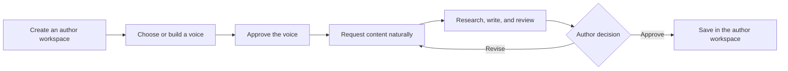

# Content Creator

Content Creator helps people produce consistent, reviewable content without
giving an AI control of their identity, opinions, or publication decisions.

Each author works in a small, independent repository containing their voices,
agents, learning, drafts, and approved content. This Core repository provides
the reusable workflow, validation, and safety boundaries.

Here, **voice** means the author's written communication style: observable
patterns in how they shape text. It is not a model of the whole person and does
not claim to capture their identity, personality, beliefs, expertise, or inner
character.

Content Creator Core is distributed through PyPI as
[`content-creator`](https://pypi.org/project/content-creator/). Author
workspaces pin an exact package version so installations and upgrades remain
reproducible.

## Start here

Give this request to Codex, Claude Code, or another coding assistant with
terminal and filesystem access:

> Use [Content Creator
> Core](https://github.com/vadhoob90/Content_Creator_Core) to create a thin
> content workspace for me. Do not clone or copy Core. Follow its
> workspace-creation guide, ask me for the author and content choices you
> need, install the workspace, and validate it.

The assistant will create a separate author workspace pinned to an immutable
Core release. To set one up manually, follow
[Create a thin content workspace](docs/guides/creating-a-content-workspace.md).

## How it works

Persisted files—not chat history—hold workflow state. Core returns content for
human review and does not publish externally.

For a system-level view of the human interaction, agent workflow, persisted
artifacts, provider-neutral LLM layer, and the boundary between Core and the
Author's workspace, see
[How Content Creator works](docs/guides/how-content-creator-works.md).

Core can also explain the exact runtime composition for every agent: preview it
before a run, trace source loading while content is created, or inspect the
persisted provenance afterwards. See
[runtime context composition](docs/guides/runtime-context-composition.md).

### 1. Create an author workspace

The generated repository belongs to the author. It keeps editorial material
separate from the reusable engine and can have its own agents, policies,
content packs, and learning. Core is installed as a versioned dependency; its
source is not copied into the workspace.

### 2. Choose a voice route

An author can build a reviewable voice candidate from authorised writing or
start with the neutral Clear Professional Starter. No candidate becomes active
without human approval.

See [Voice onboarding](docs/guides/voice-onboarding.md) for the lifecycle and
[How voice is derived](docs/guides/how-voice-is-derived.md) for the underlying
safeguards. Once a source-derived voice is active, routine rebuilds preserve
its approved guidance by default. Follow
[Safe voice evolution](docs/guides/voice-evolution.md) when adding evidence or
proposing a rule change.

### 3. Ask for content naturally

Open the author workspace in a supported coding assistant and describe what
you need:

> Write a short LinkedIn post explaining why calculus matters to sixth-form
> students. No external research is required.

The coordinator selects the approved voice and content pack, follows the
required research and review route, and preserves the work for author review.
“Publish” means saving an approved copy inside the author workspace.

See [Content Creator Coordinator](docs/guides/content-coordinator.md) for
conversational and terminal use.

## Optional features to explore

- [Visual asset packs](docs/guides/visual-assets.md) add reviewable visuals to
  supported content workflows.
- [Statistical voice scoring](docs/guides/linguistic-voice-framework.md) extends
  voice review with optional analysis.

These features are optional; their focused guides explain setup, operation,
and safeguards.

## What the author controls

- Voice evidence, candidates, approvals, and active versions
- Perspectives, editorial policies, and repository-owned agents
- Research, drafts, critiques, learning, and run history
- Approval to save content in the repository

Core supplies the shared orchestration, schemas, provider adapters,
validation, checkpoints, and safety rules.

## Important boundaries

- The author remains the final editorial authority.
- Core does not invent personal experience, beliefs, facts, or voice evidence.
- Voices and their learning remain isolated from one another.
- No-research requests remain no-research.
- Voice activation and repository publication require explicit approval.
- External publication is not supported.

For the design rationale, read
[Content Creator compared with a general-purpose chat app](docs/guides/why-not-just-chat.md).

## Documentation

Use the [task-oriented documentation index](docs/README.md) to find guides for
workspace setup, voice management, content creation, upgrades, troubleshooting,
and Core development.

## Work on Content Creator Core

Clone this repository only when you want to inspect or change the reusable
engine. The [Core development guide](docs/core/README.md) covers installation,
architecture, testing, and releases. The
[engineering standards](docs/core/engineering-standards.md) define the quality,
compatibility, security, and release controls.
The [architecture and development guardrails](docs/core/architecture-guardrails.md)
are the quickest entry point to the enforced module, dependency, TDD, schema,
function readability, complexity, naming, operations, and release rules.

External code contributions are not currently accepted. Bug reports and
feature requests are welcome through GitHub Issues; read
[Contributing](CONTRIBUTING.md) first. Report security-sensitive issues through
the private process in the [security policy](SECURITY.md).

## Licence

Content Creator is free and open-source software licensed under the
[GNU Affero General Public License, version 3 or later](LICENSE.md)
(`AGPL-3.0-or-later`). Commercial use is permitted subject to the licence
terms. See [Licensing](LICENSING.md) for a plain-language overview.

Copyright © 2026 Bharath Vadhoola
