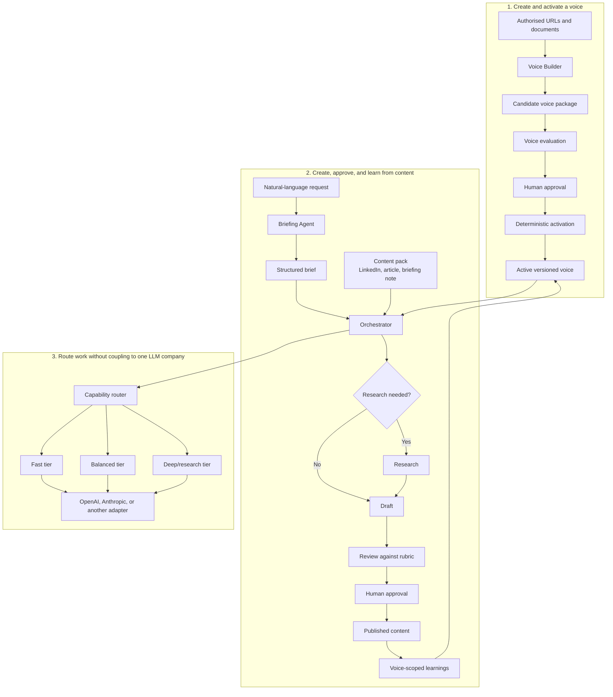

# Content Creator

A provider-neutral foundation for creating researched or non-researched content
in a person's approved voice.

The repository separates four concerns:

- **voice**: how a person sounds, including evidence, constraints, and learnings;
- **content packs**: what is being produced, such as a LinkedIn post or article;
- **workflow**: briefing, optional research, drafting, review, approval, and learning;
- **models**: which provider and capability tier executes each task.

## How the system fits together



The user can make the same request regardless of provider:

> Write a short LinkedIn post explaining why calculus matters to sixth-form
> students. No research is required.

The Briefing Agent turns that into a structured brief. The orchestrator decides
which workflow stages and capability tiers are needed. Provider adapters translate
the same internal request into each vendor's API format.

## Repository status

This first commit is an **implementation-ready scaffold**, not a finished content
engine. It contains:

- the reviewed architecture and delivery work package in [`docs/work-package`](docs/work-package);
- a provider-neutral capability catalogue and deterministic routing helper;
- a general text content-pack skeleton;
- initial tests for configuration and routing;
- the non-commercial software licence.

The staged implementation and acceptance criteria are in
[`docs/work-package/delivery-plan.md`](docs/work-package/delivery-plan.md) and
[`docs/work-package/testing-and-acceptance.md`](docs/work-package/testing-and-acceptance.md).

## Quick start

Requires Python 3.11 or newer.

```bash
python -m pip install -e .
content-creator doctor
content-creator plan --provider openai --complexity simple
content-creator plan --provider anthropic --complexity deep
```

`plan` does not call an LLM. It demonstrates that workflow code selects a
capability tier first and resolves the provider-specific model only at the adapter
boundary.

## Configuration

[`config/providers.json`](config/providers.json) is the model catalogue. Model
identifiers are environment-variable references so model changes do not require
rewriting agents or orchestration code.

```bash
export OPENAI_FAST_MODEL="<your fast OpenAI model>"
export ANTHROPIC_DEEP_MODEL="<your deep Anthropic model>"
```

A deployment may set one provider as its default, while a request may override it.
The same agents and content packs are reused either way.

## Licence

The software is available under the
[PolyForm Noncommercial License 1.0.0](LICENSE.md). It permits non-commercial
use, modification, and distribution under its terms. It does not grant commercial
use rights and is not an OSI-approved open-source licence.

Required Notice: Copyright 2026 Bharath Vadhoola
