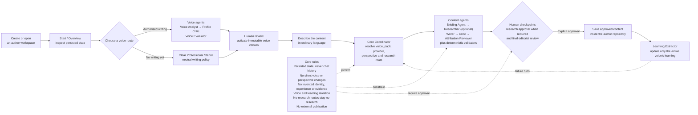

# Content Creator

Content Creator helps people produce consistent, reviewable content without
giving an AI control of their identity, opinions, or publication decisions.

Each author works in a small, independent repository containing their voices,
agents, learning, drafts, and approved content. This Core repository supplies
the reusable workflow, validation, and safety boundaries.

Read [Why not just use ChatGPT or Claude?](docs/guides/why-not-just-chat.md) for
the design rationale.

## The quickest way to start

Give this request to Codex, Claude Code, or another coding assistant with
terminal and filesystem access:

> Use [Content Creator
> Core](https://github.com/vadhoob90/Content_Creator_Core) to create a thin
> content workspace for me. Do not clone or copy Core. Follow its
> workspace-creation guide, ask me for the author and content choices you
> need, install the workspace, and validate it.

The assistant will ask about the author, intended content, writing evidence,
and model provider. It will then create a separate workspace pinned to an
immutable Core release.

Prefer doing it yourself? Follow
[Create a thin content workspace](docs/guides/creating-a-content-workspace.md)
for the complete terminal instructions and configuration options.

## How it works

The author moves from a versioned workspace to a reviewed draft through one
guided flow. Core's rules remain authoritative underneath every agent:

### 1. Create an author workspace

The generated repository belongs to the author. It keeps their editorial
material separate from the reusable engine and can have its own writer,
researcher, critic, policies, and learning.

Core is installed as a versioned dependency; its source code is not copied
into each content repository.

### 2. Choose a voice route

The author chooses one of two starting points:

- **Use previous writing** to build a reviewable voice candidate from
  authorised documents or URLs.
- **Start without previous writing** using the neutral Clear Professional
  Starter, which does not claim to imitate the author.

No candidate becomes active without human approval. A new subject also does
not automatically require a new voice; it may be better represented as a
separately governed perspective.

See [Voice onboarding](docs/guides/voice-onboarding.md) for the commands and
lifecycle, or [How voice is derived](docs/guides/how-voice-is-derived.md) for
the underlying analysis and safeguards.

### 3. Ask for content naturally

Open the author workspace in a supported coding assistant and describe what
you need:

> Write a short LinkedIn post explaining why calculus matters to sixth-form
> students. No external research is required.

The Content Creator Coordinator reads the workspace state, proposes the
appropriate voice and format, follows the required research and review
checkpoints, and preserves the run artifacts.

The result always comes back for human review. “Publish” means saving an
approved copy inside the author repository; Core does not post to external
platforms.

See [Content Creator Coordinator](docs/guides/content-coordinator.md) for
conversational and direct terminal use.

## What the author controls

The author workspace owns:

- voice evidence, candidates, approvals, and immutable versions;
- perspectives and their provenance;
- repository-specific agents and editorial policies;
- repository-wide and voice-scoped learning;
- research, drafts, critiques, and run history; and
- approved content.

Core owns the reusable orchestration, schemas, provider adapters, validation,
checkpoints, safety rules, prompt composition, and workspace generator.

## Important boundaries

- The author remains the final editorial authority.
- Core does not invent personal experience, beliefs, facts, or voice evidence.
- Voices and learning are isolated from one another.
- No-research requests remain no-research.
- Voice activation and repository publication require explicit approval.
- External publication is not supported.

## Guides

Use the [task-oriented documentation index](docs/README.md) to create a
workspace, manage a voice, create content, maintain a downstream repository, or
develop Core. Detailed terminal procedures remain in the focused guides.

## Work on Content Creator Core

Clone this repository only when you want to inspect or change the reusable
engine. The [Core development guide](docs/core/README.md) covers installation,
architecture, testing, and releases.

External code contributions are not currently accepted. Bug reports and
feature requests are welcome through GitHub Issues; read
[Contributing](CONTRIBUTING.md) first.

## Licence

Content Creator is free and open-source software licensed under the
[GNU Affero General Public License, version 3 or later](LICENSE.md)
(`AGPL-3.0-or-later`). Commercial use is permitted subject to the licence
terms. See [Licensing](LICENSING.md) for a plain-language overview.

Copyright © 2026 Bharath Vadhoola
