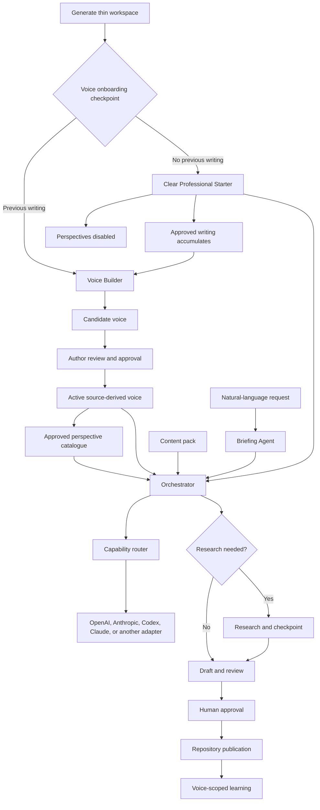

# Content Creator

Content Creator helps a person create consistent, reviewable content in a thin,
author-owned workspace while reusable orchestration remains in Core.

The LLM supplies intelligence; the scaffolding supplies direction, memory,
boundaries and accountability.

ChatGPT and Claude already provide capable conversation, instructions, files,
and memory. Content Creator adds a provider-neutral publication workflow with
explicit voice provenance, scoped learning, immutable versions, research
checkpoints, and author approval. Read
[Why not just use ChatGPT or Claude?](docs/guides/why-not-just-chat.md).

## Create your content workspace

Most people should not clone this repository. Version `0.4.0` is currently
unreleased. To evaluate the workspace generator from the development branch:

```bash
uv tool install \
  "content-creator @ git+https://github.com/vadhoob90/Content_Creator_Core.git@main"

content-creator workspace create Content_Creator_Alice \
  --name "Content Creator Alice" \
  --author-name "Alice Example" \
  --voice-id alice-general \
  --pack linkedin-post \
  --pack linkedin-article \
  --core-ref main
```

`main` is a moving development preview, not a production dependency. After
`v0.4.0` is published, install and pin that immutable tag instead.

The generated repository owns Alice's voices, sources, perspectives, learning,
agents, drafts, tests, and publications. It pins Core rather than copying the
engine. Enter it and check the installation:

```bash
cd Content_Creator_Alice
uv sync --dev
uv run content-creator --workspace . doctor
uv run pytest
```

Select a provider deliberately. The choice is persisted in the workspace:

```bash
uv run content-creator --workspace . provider select codex-native
uv run content-creator --workspace . provider verify codex-native
```

See [Create a thin content workspace](docs/guides/creating-a-content-workspace.md)
for all options and the generated repository layout.

## First checkpoint: choose a voice route

The generated workspace begins with voice onboarding marked `undecided`. The
author—not the assistant—chooses one of two routes.

### Use previous writing

Choose this route when the author can provide documents, Markdown files, or
authorised URLs:

```bash
uv run content-creator --workspace . voice onboard alice-general \
  --strategy source-derived \
  --author-name "Alice Example" \
  --selected-by "Alice Example" \
  --use linkedin-post \
  --use linkedin-article
```

Point Core at an existing local directory. Files are read recursively in place;
they are not uploaded to GitHub or copied into the workspace:

```bash
uv run content-creator --workspace . voice add-sources alice-general \
  --documents "/absolute/path/to/my-writing"
uv run content-creator --workspace . voice build alice-general
uv run content-creator --workspace . voice show alice-general
uv run content-creator --workspace . voice verify alice-general
uv run content-creator --workspace . voice approve alice-general \
  --approved-by "Alice Example"
```

Public URLs may instead be listed in
`voice-material/alice-general/source-urls.txt`. Uploaded documents and local
work-order paths are ignored by Git; versioned artifacts retain privacy-safe
references and content hashes.

### Begin without previous writing

Choose the Clear Professional Starter:

```bash
uv run content-creator --workspace . voice onboard alice-general \
  --strategy starter \
  --author-name "Alice Example" \
  --selected-by "Alice Example" \
  --use linkedin-post \
  --use linkedin-article
```

The starter is a neutral writing policy, not a synthetic version of Alice's
personality, experience, opinions, or established voice. Core automatically
disables perspectives while it is active and records that no author evidence
was used.

Approved writing can later become evidence for a source-derived candidate.
Activating that candidate replaces the starter as the active version and
restores the workspace's normal perspective policy. Core never performs that
transition silently.

Read [Voice onboarding](docs/guides/voice-onboarding.md) for the lifecycle,
safeguards, and transition procedure. The detailed derivation algorithm is in
[How Content Creator derives a voice](docs/guides/how-voice-is-derived.md).

## Create content

Open the thin workspace in Codex or Claude Code and ask naturally:

> Write a short LinkedIn post explaining why calculus matters to sixth-form
> students. No external research is required.

The workspace guidance resolves the voice, pack, research route, evidence, and
approval points. It preserves the run artifacts and returns the draft for
review. It does not publish externally.

The equivalent CLI request is:

```bash
uv run content-creator --workspace . run \
  "Explain why calculus matters to sixth-form students" \
  --voice alice-general \
  --pack linkedin-post \
  --research none
```

After review, repository-local publication is explicit:

```bash
uv run content-creator --workspace . publish <run-id> \
  --feedback "Preserve the concrete opening."
```

Publication never overwrites an existing file and updates only that voice's
learning memory.

## How the system fits together



Every run records the exact content pack, voice strategy and version, allowed
perspectives, research state, agent instructions, and learning memories used.

## Learn more

- [Create a thin content workspace](docs/guides/creating-a-content-workspace.md)
- [Voice onboarding](docs/guides/voice-onboarding.md)
- [How voice is derived](docs/guides/how-voice-is-derived.md)
- [Perspective provenance](docs/guides/perspective-provenance.md)
- [Repository-owned agents](docs/guides/repository-agents.md)
- [Provider configuration](docs/guides/provider-configuration.md)
- [Versioned Core dependencies](docs/guides/workspace-dependencies.md)
- [Changelog](CHANGELOG.md)
- [Migrating to v0.4](docs/guides/migrating-to-v0.4.md)

## Work on Content Creator Core

Clone Core only when you want to understand or change the reusable engine,
provider adapters, contracts, validation, packaged resources, or workspace
generator.

The [Core development README](docs/core/README.md) explains how to clone,
install, navigate, test, modify, and validate this repository without confusing
Core-owned mechanisms with downstream editorial policy.

## Licence

Content Creator is free and open-source software licensed under the
[GNU Affero General Public License, version 3 or (at your option) any later
version](LICENSE.md) (`AGPL-3.0-or-later`).

Commercial use is permitted under the AGPL. If you modify the program and make
the modified version available for users to interact with remotely over a
network, the AGPL requires you to offer those users the corresponding source
code of that version. The licence text controls; see
[Licensing](LICENSING.md) for a plain-language overview.

External code contributions are not currently accepted. Bug reports and
feature requests are welcome through GitHub Issues; read
[Contributing](CONTRIBUTING.md) first.

Copyright © 2026 Bharath Vadhoola
