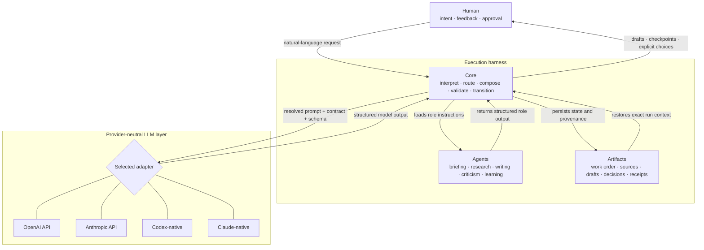
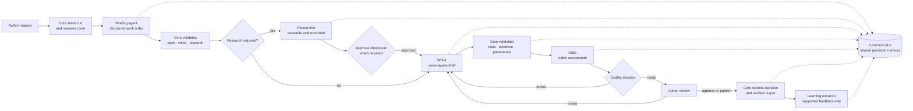
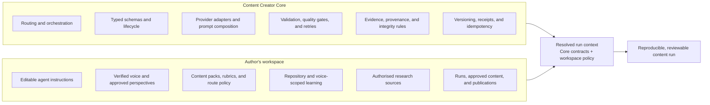

# How Content Creator works

Content Creator separates human editorial authority, governed workflow
execution, and model capability. The human works in natural language, Core
coordinates the lifecycle, repository-owned agents specialise each role, and
persisted artifacts keep the run reviewable without relying on chat history.

The diagrams below show the same system from three perspectives.

## Human, execution harness, and LLMs

Here, **execution harness** is a descriptive term for the complete runtime
assembly: Core mechanisms, the selected workspace agents, and the persisted run
artifacts they produce. It is not a separate package or an additional source of
editorial authority.

The LLM does not own workflow state or decide whether a voice, research
checkpoint, draft, or publication is approved. Core selects one configured
adapter for a request, validates its output, and persists the resulting state
in the Author's workspace.

## Agent interaction

Agents are specialised contributors rather than autonomous peers. Core gives
each agent only its resolved role context, validates the response, records the
artifacts, and determines which transition is allowed next.

Research approval appears only on routes that require it. No-research routes
remain no-research, and the author remains the final authority for revision,
approval, and repository publication.

## Core and the Author's workspace

Core owns reusable mechanisms and non-negotiable contracts. The Author's
workspace owns editorial policy, identity-linked material, learning, and
content. The resolved run context combines both without copying Core into the
workspace.

This boundary allows Core to evolve as a reusable dependency while every
author retains control of their own voice, agents, policies, evidence, run
history, and approved content.

For the exact prompt and context assembly order, see
[Runtime context composition](runtime-context-composition.md). For the design
rationale, see
[Content Creator compared with a general-purpose chat app](why-not-just-chat.md).
