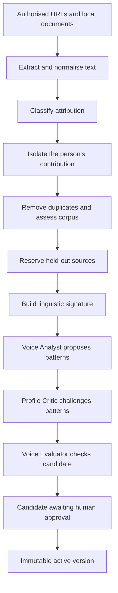

# How Content Creator derives a voice

This guide explains how Content Creator turns authorised source material into a
reviewable and versioned writing voice. It starts with the conceptual model,
then follows the lifecycle, and finally documents the algorithms and current
implementation limits.

The short version is:

```text
authorised sources
→ attributed and weighted corpus
→ deterministic linguistic measurements
→ evidence-backed pattern proposals
→ independent criticism and evaluation
→ human review
→ immutable active voice version
```

Content Creator does not fine-tune a model on the source documents, and it does
not claim to identify an author from writing alone. The result is an
evidence-backed editorial profile: a controlled description of how a person
communicates in the contexts represented by the supplied material.

## 1. What a voice contains

A voice describes recurring communication choices such as:

- register and relationship with the reader;
- discourse structure and rhetorical progression;
- stance, qualification, emphasis, and reader address;
- syntax, sentence rhythm, and paragraph shape;
- lexical, connective, contraction, and punctuation patterns; and
- explicit guidance and anti-patterns for using those observations safely.

A voice is deliberately separate from:

| Concern | Meaning |
|---|---|
| Voice | How the person tends to communicate |
| Editorial preference | An explicit instruction such as “avoid canned LLM phrasing” |
| Perspective | A position the person has explicitly stated or approved |
| Research | External evidence gathered for a particular piece |
| Learning | A reviewed preference extracted from later edits or publications |

Source analysis may reveal a recurring stylistic behaviour, but it must not be
used to infer biography, experience, beliefs, personality, protected
characteristics, or mental state. Preferences that cannot be reliably inferred
from a corpus should remain explicit, voice-scoped rules or learnings.

## 2. Lifecycle at a glance



The build may stop before approval when attribution, corpus sufficiency, or
evaluation gates are not met. No agent can activate its own result.

## 3. Source authorisation and privacy

Only material that the repository owner is authorised to analyse should enter
a voice corpus.

Local files supplied through `--documents` are treated as directly authored
when the work order contains an explicit authorisation attestation. They do not
need a public URL or embedded byline. This permits unpublished drafts,
Markdown files, exported documents, and other private writing to contribute to
the profile.

Remote pages and transcripts still go through attribution analysis. A document
should not be locally attested when it is substantially written by another
person or when a co-author's contribution cannot safely receive full voice
weight.

Extracted source text is stored under the ignored `.voice-cache/<voice-id>/`
directory. The candidate and active version retain source provenance, content
hashes, attribution decisions, analysis scope, and cache paths. Private source
text is therefore available for local audit and overlap checking without being
silently copied into the versioned profile.

## 4. Ingestion and normalisation

The ingestion layer accepts:

| Input | Extraction method |
|---|---|
| Remote HTTP or HTTPS page | Decode response, remove common non-content HTML, strip tags |
| Local HTML | Apply the same HTML extraction |
| DOCX | Read paragraphs from `word/document.xml` |
| PDF | Extract page text with `pypdf` |
| Markdown, text, or another text-readable file | Read as UTF-8 text |

Normalisation:

1. decodes HTML entities;
2. converts line endings to `\n`;
3. collapses horizontal whitespace;
4. trims individual lines; and
5. reduces three or more newlines to one paragraph break.

The normalised content receives a SHA-256 hash. This supports provenance and
change detection; it is not an authorship signal.

### Duplicate detection

Each normalised source is compared with earlier sources using Python's
`SequenceMatcher`. A similarity ratio of `0.92` or higher marks the later
source as a near-duplicate and excludes it from analysis.

This is approximate text comparison, not embedding-based semantic duplicate
detection. It is intended to stop the same publication from receiving extra
weight merely because it appears in several formats or locations.

## 5. Attribution and voice weighting

Attribution controls both whether text is analysable and how strongly it
influences corpus-level measurements.

The deterministic classifier looks for:

- author and byline markers;
- co-authorship markers;
- speaker-labelled transcript turns;
- mentions that make the person the subject rather than the author; and
- absence of reliable authorship evidence.

Current default classifications and weights are:

| Classification | Voice weight | Analysis scope |
|---|---:|---|
| Attested local document | `1.00` | Full document |
| Directly authored | `1.00` | Full text, with leading byline removed |
| Co-authored | `0.65` | Shared source |
| Interview contribution | `0.50` | Target person's labelled turns only |
| Person as subject | `0.00` | Excluded pending review |
| Uncertain | `0.00` | Excluded pending review |

When a deterministic result needs human review and a model-backed runner is
configured, the Attribution Reviewer receives the person, aliases, source kind,
title, and a bounded excerpt. It must resolve attribution only from the supplied
evidence and retain zero voice weight when uncertainty remains.

A source becomes approved for analysis only when:

```text
voice weight > 0
and source is not a near-duplicate
and isolated analysis text is not empty
```

### Transcript isolation

For speaker-labelled transcripts, a small state-machine parser recognises
lines shaped like:

```text
Speaker: contribution
```

It retains the target person's labelled contribution and continuation lines
until another speaker label appears. Interviewer and other-speaker text is not
included in the target person's linguistic measurements.

## 6. Corpus sufficiency

Corpus sufficiency uses attribution-weighted analysable words:

```text
weighted words = Σ(analysis word count × source voice weight)
```

For example:

```text
1,000 directly authored words      = 1,000 weighted words
1,000 co-authored words            =   650 weighted words
1,000 interview-contribution words =   500 weighted words
```

The current minimum build gate is `500` weighted words. The corpus report uses:

| Condition | Reported support |
|---|---|
| At least three directly authored sources and 3,000 weighted words | High |
| At least 500 weighted words | Medium |
| Below 500 weighted words | Low and insufficient |

The report also flags a lack of source-kind diversity. These values are
engineering gates, not evidence that a particular corpus size is sufficient to
prove a unique personal style.

## 7. Training, measurement, and held-out allocation

The implementation does not train a model. It divides eligible material into
measurement, semantic-analysis, and evaluation sets.

When at least two usable sources exist, the builder reserves:

```text
min(10, max(1, usable source count // 10))
```

sources as held-out material. Selection is an even, deterministic spread across
the ordered corpus. Held-out sources do not contribute to the linguistic
signature or the Voice Analyst's pattern evidence.

The remaining sources contribute to deterministic measurements. An evenly
distributed sample of at most 50 sources is sent for semantic analysis. When a
source excerpt exceeds 6,000 characters, the builder samples its beginning,
middle, and end.

This deterministic allocation makes builds reproducible and gives the evaluator
material that the analyst did not see.

## 8. Deterministic linguistic signature

The linguistic signature uses lightweight corpus stylistics. Measurements are
descriptive evidence—not generation targets and not an authorship judgement.

### Tokenisation and segmentation

Words are identified using an English-letter regular expression that preserves
internal apostrophes. Sentences are split at `.`, `!`, or `?` followed by
whitespace. Paragraphs are separated by blank lines.

These rules are intentionally transparent, but they are not a full linguistic
parser.

### Structural and rhythm measurements

For each source the implementation calculates:

- word, sentence, and paragraph counts;
- median sentence length;
- first and third sentence-length quartiles;
- population standard deviation of sentence length;
- ratio of sentences containing at most eight words;
- ratio of sentences containing at least 25 words;
- median paragraph length;
- questions per 100 sentences; and
- exclamations per 100 sentences.

### Stance and relationship measurements

English-specific lexicons count, per 1,000 words:

- first-person pronouns;
- second-person pronouns;
- modal verbs;
- hedges;
- boosters;
- contractions;
- contrast markers;
- example markers; and
- conclusion markers.

The signature also records dashes, semicolons, and colons per 1,000 words.

For a feature count `c`, population size `n`, and reporting scale `s`:

```text
rate = (c / n) × s
```

### Lexical diversity

Lexical diversity uses moving-average type-token ratio, or MATTR, with a
50-token window:

```text
MATTR =
average(unique tokens in each 50-token window / 50)
```

For a source shorter than 50 tokens, the implementation uses the unique-token
ratio over the complete source.

### Aggregation

The implementation produces per-source profiles and aggregates them:

- overall;
- by spoken or written mode; and
- by source kind.

For each feature it records:

- attribution-weighted mean;
- median;
- first and third quartiles;
- minimum; and
- maximum.

The weighted mean is:

```text
Σ(feature value × source voice weight) / Σ(source voice weight)
```

The other distribution statistics describe the per-source values without
attribution weighting.

## 9. Model-assisted pattern interpretation

When a configured provider is available, the Voice Analyst receives:

- attributed source excerpts;
- source kind, weight, and analysis scope;
- per-source linguistic measurements;
- aggregate signature;
- intended voice label and author; and
- corpus coverage and limitations.

It returns schema-validated structured output. Each proposed pattern contains:

- stable identifier and category;
- observable description;
- possible communicative function, marked as interpretation;
- supporting and counterexample source IDs;
- contexts in which it is supported;
- generation guidance;
- an anti-pattern that prevents mechanical imitation;
- measured evidence;
- confidence; and
- `confirmed`, `provisional`, or `rejected` status.

The analyst is instructed to prefer a small, defensible profile over a vivid
caricature. It may not infer private traits, beliefs, experience, identity, or
authorship.

A claimed supporting source ID is retained only if it belongs to the approved
analysis set. A `confirmed` pattern with fewer than two supporting sources is
downgraded to `provisional`.

Without a model-backed runner, offline analysis creates only a provisional
measured rhythm pattern. This is useful for fixtures and mechanical validation,
but it is not a substitute for semantic analysis and human review.

## 10. Independent profile criticism

The Profile Critic receives the proposed analysis and deterministic signature.
It rejects patterns that:

- lack sufficient provenance;
- are topic-specific rather than stylistic;
- copy source wording;
- describe generic good writing;
- confuse a platform convention with personal voice;
- collapse materially different spoken and written registers;
- convert a descriptive range into a rigid instruction;
- ignore weak attribution or limited corpus coverage;
- claim distinctiveness without a matched-register comparison; or
- lack a usable anti-pattern and therefore encourage mannerism stacking.

The critic reports rejected pattern IDs and warnings. It cannot rewrite the
profile or decide whether it is approved.

## 11. Candidate evaluation

Every candidate receives deterministic evaluation metadata. The baseline
candidate passes when the corpus is sufficient and at least one pattern exists.
An insufficient corpus is a hard failure.

The report also records:

- whether every pattern cites a source;
- whether held-out material was allocated and excluded from pattern evidence;
- whether a linguistic signature exists;
- that caricature resistance requires evaluation; and
- that draft generation remains subject to phrase-overlap protection.

These recorded checks expose gaps for review; they are not all independent hard
gates in the current offline build.

When a model-backed runner is available, the Voice Evaluator also receives the
profile, constraints, rubric, pattern set, linguistic signature, held-out
sources, supported content packs, and adversarial cases. It assesses:

- transfer to unseen material;
- adaptation between supported channels;
- rejection of a generic draft;
- natural variation rather than metric matching;
- resistance to stacking every observed mannerism;
- absence of invented personal context; and
- absence of copied source phrasing.

Integrity failures are hard failures and cannot be averaged away by a good
overall score.

## 12. Candidate artifacts

A successful build creates `profiles/<voice-id>/candidate/` containing:

| Artifact | Purpose |
|---|---|
| `profile.md` | Human-readable candidate and evidence limits |
| `patterns.json` | Structured proposed patterns |
| `linguistic-signature.json` | Per-source and aggregate measurements |
| `source-index.json` | Provenance, attribution, weight, and analysis scope |
| `corpus-report.json` | Coverage, support, held-out allocation, and gaps |
| `constraints.json` | Mandatory personal-integrity safeguards |
| `voice-rubric.json` | Voice-specific content evaluation thresholds |
| `analyst-report.json` | Model-assisted analysis, when used |
| `critic-report.json` | Independent criticism, when used |
| `evaluation-report.json` | Build and evaluator results |
| `manifest.json` | Component paths, hashes, lifecycle status, and uses |
| `build-report.json` | Candidate hash, source failures, and final build status |

`profile.md` is lifecycle-neutral. Candidate, active, and inactive state comes
from the version manifest and registry rather than editable Markdown prose.
When Core assembles writer or critic context for an active version, it adds an
authoritative lifecycle header and removes recognised candidate-only wording
from older profiles. This keeps pre-existing immutable versions usable without
rewriting or rehashing their approved components.

A passing candidate stops at `awaiting_approval`. A non-passing candidate
remains `built` with its gaps recorded. Neither status is an active voice.

## 13. Human approval and immutable versions

The author or repository owner reviews:

- source attribution;
- corpus limitations;
- proposed and rejected patterns;
- generation guidance and anti-patterns;
- deterministic signature;
- constraints and evaluation results; and
- whether the profile actually sounds editorially correct.

Approval makes no model call. It:

1. verifies authorisation;
2. recalculates every candidate component hash;
3. refuses non-overridable integrity failures;
4. assigns a stable version such as `1.0.0`;
5. copies the candidate into an immutable version directory;
6. writes an approval receipt; and
7. atomically updates the active voice registry.

The activated version manifest is authoritative for downstream lifecycle
context. The copied profile cannot downgrade an active version to a candidate.

Every content run resolves and records a specific voice version. Later profile
changes create another version rather than silently changing the evidence used
by historical runs.

## 14. Safeguards during content generation

Voice construction and draft validation are separate stages. When an active
voice guides a draft, the runtime still enforces:

- no invented personal context;
- no mechanical targeting of measured averages;
- provisional patterns remain optional;
- no close copying from voice sources; and
- no unsupported first-person experience.

Phrase overlap currently uses exact, case-normalised 12-word n-grams. Any
matching 12-word sequence between the draft and an approved source produces an
overlap failure.

A conservative personal-experience check also detects phrases such as
`I worked`, `I led`, `I built`, `I remember`, `I experienced`, `I founded`, and
`I joined`. If the claimed phrase is unsupported by the authorised corpus, the
draft is blocked for review.

## 15. What algorithms are used

The current implementation is a hybrid:

```text
rule-based extraction and attribution
+ approximate text deduplication
+ descriptive corpus statistics
+ deterministic sampling
+ schema-constrained model interpretation
+ independent model criticism and evaluation
+ human approval
```

More specifically:

| Concern | Current algorithm |
|---|---|
| Content integrity | SHA-256 |
| Near-duplicate detection | `SequenceMatcher`, threshold `0.92` |
| Initial attribution | Regular expressions and source-type rules |
| Transcript isolation | Speaker-label state machine |
| Corpus weighting | Weighted word counts and weighted feature means |
| Sentence and word analysis | Transparent regular-expression segmentation |
| Distribution summary | Median, interpolated quartiles, population standard deviation, min/max |
| Lexical diversity | MATTR with a 50-token window |
| Source allocation | Deterministic even sampling |
| Semantic interpretation | Provider-neutral LLM with schema-validated output |
| Criticism and evaluation | Separate provider-neutral model roles |
| Draft/source copying | Exact 12-word n-gram intersection |
| Candidate integrity | Per-component and combined SHA-256 hashes |

## 16. Current limitations and non-goals

Content Creator currently does not use:

- model fine-tuning;
- author-identification classifiers;
- embedding-based clustering or semantic duplicate detection;
- neural stylometry;
- topic modelling;
- personality, demographic, or psychological inference; or
- a supplied matched-register comparison corpus.

Consequently:

- observed characteristics cannot be called unique or person-distinctive;
- topic and platform conventions may still influence a pattern;
- HTML and PDF extraction quality depends on the source structure;
- sentence segmentation is intentionally lightweight;
- stance and connective lexicons are English-specific;
- non-English structural measurements remain descriptive, but lexical
  interpretation needs language-specific support;
- model judgements remain supporting evidence rather than proof; and
- human review is the decisive authenticity test.

Blind comparison with ordinary drafts and direct author feedback remain the
strongest practical checks that an activated profile feels authentic without
becoming imitation.

## 17. Implementation map

The main implementation is under `src/content_creator/`:

| File | Responsibility |
|---|---|
| `ingestion.py` | Extraction, normalisation, hashing, and duplicate detection |
| `attribution.py` | Deterministic attribution and speaker isolation |
| `corpus.py` | Sufficiency, word weighting, and coverage gaps |
| `linguistics.py` | Feature extraction and signature aggregation |
| `voice_builder.py` | End-to-end candidate construction and model roles |
| `voices.py` | Schemas, approval, versioning, registry, and integrity checks |
| `voice_evaluation.py` | Draft integrity against an active voice |
| `overlap.py` | Exact phrase-overlap detection |
| `runner.py` | Provider-neutral, schema-constrained agent execution |

Related guides:

- [Create and approve a voice](voice-creation.md)
- [Lightweight linguistic framework](linguistic-voice-framework.md)
- [Privacy and source handling](privacy-and-sources.md)
- [Learning and publication](learning-and-publication.md)
- [Perspective provenance](perspective-provenance.md)
