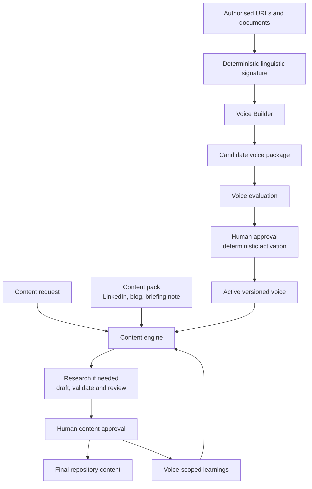

# Work package: Content Creator and Voice Builder

## Status

Implemented. This directory is the historical design and delivery record for
the initial provider-neutral Core derived from LinkedIn Writer. The shipped
product has continued to evolve; use the [documentation index](../README.md)
for current operator guidance and the [changelog](../../CHANGELOG.md) for the
release history.
Current implementation work is governed by the
[Core architecture and development guardrails](../core/architecture-guardrails.md),
not by the historical size or module layout recorded in this work package.
Those current guardrails include function complexity, length, naming, and
dispatch design as well as the module-size boundary.

## Delivered objective

The work package delivered a provider-neutral text-content system that:

- Supports multiple content types through content packs
- Supports multiple people through isolated, versioned voice packages
- Builds a voice from authorised URLs and documents
- Evaluates a candidate voice before activation
- Activates a voice through an idempotent deterministic command
- Records the exact content pack, voice, rubric and learning versions used by
  every content run
- Preserves the current LinkedIn behaviour as the first specialised pack

## Product boundary

Initial scope is text content:

- LinkedIn posts and articles
- Blog posts
- Briefing notes
- Newsletters
- Technical explainers
- Video or podcast scripts

Initial scope excludes:

- Image and video generation
- Automatic external publication
- Model fine-tuning
- Unsupported impersonation
- Automatic activation of a voice without human approval
- Automatic rewriting of a stable voice profile from one content approval

## Key design decisions

1. The product may be presented as a Voice Builder agent, but orchestration is
   deterministic application code.
2. Source ingestion, hashing, deduplication, storage, activation and registry
   updates are deterministic.
3. LLM agents are used only for ambiguous attribution review, voice analysis
   and independent profile criticism.
4. A voice is a package, not one prompt file.
5. Core editorial, channel and voice rubrics are composed at runtime.
6. Candidate voices cannot be used for content until activated.
7. `content-creator voice approve <voice-id>` is the authoritative activation
   command and is safe to rerun.
8. Source material is private by default and is not committed automatically.
9. LinkedIn Writer remains operational until the new repository passes the
   LinkedIn regression suite.
10. `voice create` runs ingestion, analysis, build and evaluation by default;
    separate commands remain available for recovery and automation.
11. Active voices can be deterministically deactivated if permission or intended
    use changes, without deleting historical run provenance.
12. “Briefing” is the user-facing request-structuring concept, implemented as
    separate content-briefing and voice-briefing contracts.
13. Deterministic linguistic measurements and descriptive corpus statistics
    support voice analysis without becoming generation targets or authorship
    claims.

## Whole system at a glance

The expected conversational path is:

1. “Create a voice for Example Person from these sources. They have authorised its use.”
2. “Show me the proposed profile and evaluation.”
3. “Approve Example Person’s voice.”
4. “Using Example Person’s voice, create a LinkedIn post about engineering leadership.”
5. “Move this to published.”

## Delivered components

- Generic `content_creator` package and `content-creator` CLI
- Content-pack interface, configurable `general-text` pack and LinkedIn packs
- Multi-profile voice registry
- URL and document ingestion
- Attribution checking
- Voice analysis and profile criticism
- Voice compilation and evaluation
- Deterministic approval and activation
- Runtime context resolution and immutable run snapshots
- Profile-scoped learning
- Offline software and evaluation harnesses
- Manual live-provider evaluations
- Codex skills, CLI documentation and migration guide

## Work-package contents

- [Architecture](architecture.md)
- [Schemas and commands](schemas-and-commands.md)
- [Configurable general-text pack](general-text-pack.md)
- [Delivery plan](delivery-plan.md)
- [Testing and acceptance](testing-and-acceptance.md)
- [Migration and rollout](migration-and-rollout.md)
- [Final design review](final-review.md)
- [Machine-readable backlog](work-package.yaml)

## Acceptance outcome

The implemented baseline was accepted when a fresh clone could:

1. Build a candidate voice from fixture URLs and documents
2. Refuse to use that candidate before approval
3. Activate it deterministically
4. Create content using the exact active voice version
5. Evaluate content with core, channel and voice rubrics
6. Approve content and update only that voice’s learning memory
7. Run the migrated LinkedIn workflows without behavioural regression
8. Deactivate a voice deterministically while preserving historical runs
