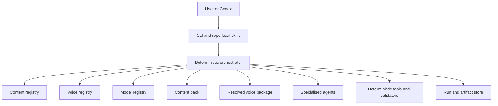
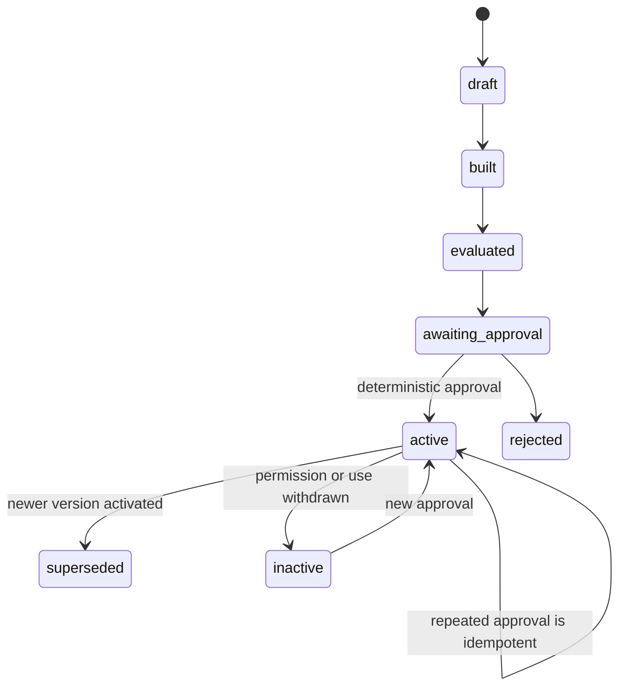

# Architecture

## System structure



The orchestrator resolves configuration and owns stage order, state,
checkpoints, retries, bounded revision and activation. Agents never activate a
voice, publish content, select arbitrary models or mutate registries.

## Repository layout

```text
content-creator/
├── src/content_engine/
│   ├── domain.py
│   ├── orchestrator.py
│   ├── context.py
│   ├── storage.py
│   ├── quality.py
│   ├── providers/
│   ├── voices/
│   └── packs/
├── agents/
│   ├── briefing/
│   │   ├── content-briefing.md
│   │   └── voice-briefing.md
│   ├── researcher.md
│   ├── writer.md
│   ├── critic.md
│   ├── voice-analyst.md
│   ├── attribution-reviewer.md
│   └── profile-critic.md
├── packs/
│   ├── general-text/
│   ├── linkedin-post/
│   ├── linkedin-article/
│   └── briefing-note/
├── profiles/
│   ├── registry.yaml
│   └── <voice-id>/
├── rubrics/
│   └── core.yaml
├── evals/
├── tests/
├── .voice-cache/
└── runs/
```

`.voice-cache/`, `runs/` and live evaluation results are ignored. Approved
profile manifests, constraints, rubrics, provenance metadata and test cases are
version controlled.

## Content composition

A content run resolves three policy layers:

```text
core editorial policy
    + selected content-pack policy
    + selected voice-package policy
    + explicit run instructions
```

Merge rules are deterministic:

- Integrity constraints cannot be overridden
- Explicit author instructions override stylistic preferences
- Content-pack rules apply only to their channel or artifact type
- Voice rules apply only to the selected `voice_id`
- Provisional learnings are recorded but excluded from prompts

`general-text` supplies the common text pipeline and can be used directly.
Specialised packs extend one versioned base and may add channel rules without
removing integrity validators. See `general-text-pack.md`.

## Voice-building stages

| Stage | Implementation | Responsibility |
|---|---|---|
| Voice briefing | Rules, optional voice-briefing agent | Identity, permission, intended use and sources |
| Ingestion | Deterministic tools | Download, parse, clean, hash and deduplicate |
| Attribution | Rules, optional review agent | Classify source authorship and usable sections |
| Corpus assessment | Deterministic metrics | Sufficiency, diversity, channel coverage and gaps |
| Voice analysis | Voice analyst agent | Evidence-backed voice-pattern candidates |
| Profile criticism | Profile critic agent | Challenge weak, copied or caricatured patterns |
| Compilation | Deterministic code | Build candidate package and validate references |
| Evaluation | Harness and optional judge | Held-out, integrity, overlap and transfer tests |
| Approval | Human | Authorise the exact candidate version |
| Activation | Deterministic transaction | Register and lock the approved version |

Content creation uses the parallel `content-briefing` contract to produce a
validated `ContentBrief`. Explicit requests are handled deterministically;
briefing agents are called only for material ambiguity.

## Voice lifecycle



Candidate packages cannot be selected by a content run. A request naming a
candidate fails with a command the user can run to activate it.

## Activation transaction

`content-creator voice approve <voice-id>`:

1. Acquires a voice-specific lock
2. Resolves the exact candidate version
3. Validates authorisation and schema
4. Verifies required evaluation gates
5. Hashes profile components
6. Creates an immutable approval receipt
7. Assigns the stable semantic version
8. Initialises or verifies the learning namespace
9. Atomically updates the profile manifest and central registry
10. Writes the resolved lock file
11. Appends an audit event
12. Releases the lock

Failure before the atomic registry update leaves the active voice unchanged.
Running the command again for the same candidate returns success without
creating another version.

`content-creator voice deactivate <voice-id> --reason <reason>` is also
deterministic. It removes the voice from future resolution while preserving
manifests, approval receipts and historical run snapshots.

## Runtime cascade

Selecting an active voice causes the context resolver to load:

- Generic writer and critic definitions
- Content-pack prompts, validators and rubric
- Exact voice profile version
- Voice constraints and voice rubric
- Active learnings for that voice
- Core editorial rubric

The result is persisted as `resolved-context.json`, including component
versions and hashes. Later profile changes affect future runs only.

## Learning

Content approval may add learning candidates scoped by:

- `voice_id`
- Voice version
- Content pack
- Artifact type
- Topic scope
- Source feedback event

Explicit feedback may be active. Inference from publication or draft
comparison remains provisional. Stable profile changes require a new candidate
profile version, evaluation and activation.

## Security, privacy and provenance

- Voice creation requires a recorded user attestation of authorisation and
  intended use; the local tool does not independently prove legal identity
- Private documents are excluded from Git by default
- Complete downloaded web pages are stored only in the local cache
- Approved packages store metadata, hashes and minimal supporting excerpts
- Every source records its access basis and retention policy
- No agent can assert authorship without evidence
- Uncertain attribution requires human review or zero voice weight
- Content generation cannot invent personal facts absent from the brief or
  approved profile
- Phrase-overlap checks prevent source reproduction
- Deactivation immediately prevents new runs from resolving the voice
